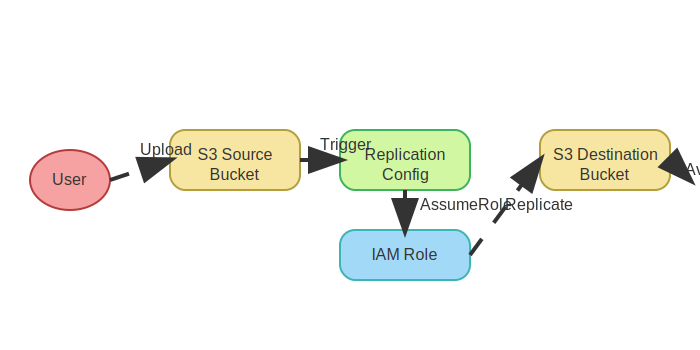

# ☁️ AWS S3 Cross-Region Replication with Terraform

This repo demonstrates how to set up **S3 Cross-Region Replication (CRR)** using **Terraform**, enabling automatic object replication between two S3 buckets in different AWS regions.

---

## 📌 What is CRR?

**CRR (Cross-Region Replication)** replicates S3 objects from a source bucket in one AWS region to a destination bucket in another. It’s commonly used for:

- 🔁 Disaster recovery  
- 🌍 Low-latency access  
- 🔒 Compliance & backup  
- 🎯 Data sovereignty

For same-region replication, AWS also supports **SRR (Same-Region Replication)**.

---

## 🧱 Architecture

<!--  -->



---

## ✅ Features

- Creates **two S3 buckets** in different regions
- Enables **versioning** on both
- Configures **IAM role** for replication
- Defines **replication rules**
- Uses **Terraform modules/providers** with best practices

---

## 🧩 Technologies Used

- AWS S3
- IAM
- Terraform `>= 1.3`
- Provider aliases

---

## 🚀 How to Use

1. Clone the repo:
   ```bash
   git clone https://github.com/Chetan2098/S3-Cross-Region-Replication.git
   S3-Cross-Region-Replication.git
   cd S3-Cross-Region-Replication
