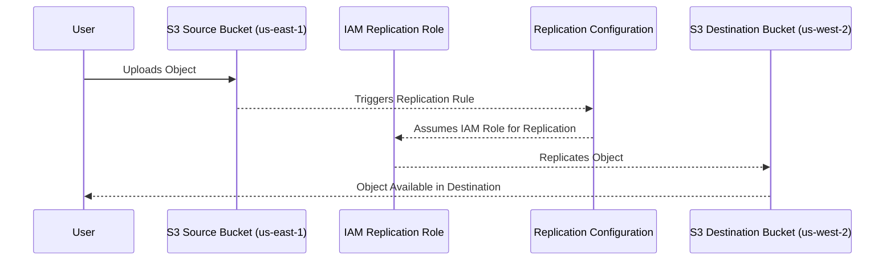

```mermaid
%% S3 Cross-Region Replication Animated Diagram

sequenceDiagram
    participant User
    participant SourceBucket as S3 Source Bucket (us-east-1)
    participant IAMRole as IAM Replication Role
    participant ReplicationConfig as Replication Configuration
    participant DestinationBucket as S3 Destination Bucket (us-west-2)

    User->>SourceBucket: Uploads Object
    SourceBucket-->>ReplicationConfig: Triggers Replication Rule
    ReplicationConfig-->>IAMRole: Assumes IAM Role for Replication
    IAMRole-->>DestinationBucket: Replicates Object
    DestinationBucket-->>User: Object Available in Destination
```