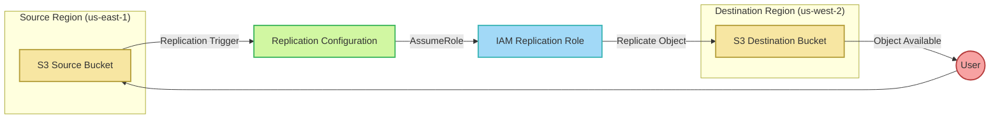

```mermaid
%% S3 Cross-Region Replication Diagram with Color

flowchart LR
    subgraph Source["Source Region (us-east-1)"]
        A[S3 Source Bucket]:::bucket
    end
    subgraph Dest["Destination Region (us-west-2)"]
        B[S3 Destination Bucket]:::bucket
    end
    IAM[IAM Replication Role]:::role
    RepConfig[Replication Configuration]:::config

    User((User)):::user --> A
    A -- "Replication Trigger" --> RepConfig
    RepConfig -- "AssumeRole" --> IAM
    IAM -- "Replicate Object" --> B
    B -- "Object Available" --> User

    classDef bucket fill:#f7e6a2,stroke:#b59f3b,stroke-width:2px;
    classDef role fill:#a2d9f7,stroke:#3bb5b5,stroke-width:2px;
    classDef config fill:#d1f7a2,stroke:#3bb55b,stroke-width:2px;
    classDef user fill:#f7a2a2,stroke:#b53b3b,stroke-width:2px;
```